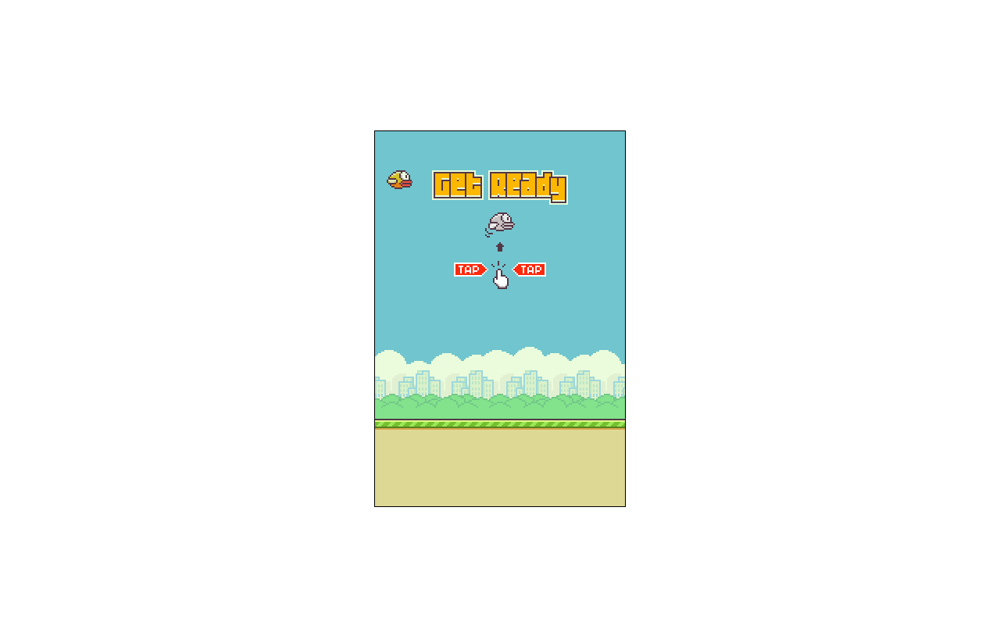

# [The Flappy Bird](https://flappy-bird-game.vercel.app/)

O projeto inteiro foi desenvolvido com JavaScript puro, Canvas API, conceitos de orientação a objeto.

* A aplicação conta com um sistema de pontuação que salva e armazena o recorde do jogador no próprio browser através do **LocalStorage**. O progresso só é       perdido caso o usuário limpe o cache do navegador.
* O passarinho, plano de fundo, os canos infinitos e tudo que aparece na telinha foram desenhados através da função **DrawImage**, disponibilizada pela API do **Canvas**, e usa um sistema de pixels para organização.
* E além do uso através do mouse para cada pulinho do pequeno flappy, também é possível utilizar a barra de espaço para se esquivar dos canos.
* O game também conta com um sistema de som para cada possível ação do pássaro, desde a batida de asas até a colisão com o chão e os canos.
